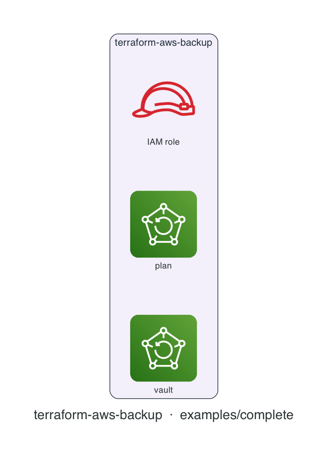

# terraform-aws-backup

[](https://github.com/devotica-labs/terraform-aws-backup/actions/workflows/ci.yml)
[](https://github.com/devotica-labs/terraform-aws-backup/actions/workflows/release.yml)
[](LICENSE)

> Part of the **Devotica** Terraform catalog. Follows the cloudposse module standard (README.yaml-driven docs, the `enabled`/`namespace`/`environment`/`stage`/`name`/`attributes`/`tags`/`label_order` label surface, `examples/complete`, Makefile targets) implemented **natively** — no external naming or build-harness dependencies.

## Introduction

Terraform module for **AWS Backup** — a KMS-encrypted backup vault, a plan with one or more scheduled rules, a resource/tag selection, and a dedicated service role. It ships fintech-safe defaults so a workload is centrally backed up, encrypted, and retained out of the box.

Defaults are opinionated: an **encrypted vault**, a **daily rule with 35-day retention**, an auto-created **service role** (trusting `backup.amazonaws.com`, with the AWS-managed backup + restore policies), optional **cold storage**, and an optional **compliance vault lock** (WORM) for regulated data.

## Architecture

<!-- BEGIN_ARCH -->



<sub>Generated by `.github/workflows/architecture-diagram.yml` on every push to main. Do not edit the image by hand — change the Terraform code in `examples/complete/` and the bot will regenerate it.</sub>

<!-- END_ARCH -->

## Usage

```hcl
module "backup" {
  source  = "devotica-labs/backup/aws"
  version = "~> 0.1"

  namespace = "dvtca"
  stage     = "prod"
  name      = "db"          # vault/plan → dvtca-prod-db

  # Tag-based selection: back up every resource tagged backup=daily.
  selection_tags = {
    backup = "daily"
  }

  # Fintech defaults cover encryption, the daily 35-day rule, and the role.
  tags = local.tags
}
```

Tiered rules with explicit resource ARNs, a customer-managed key, and a compliance vault lock:

```hcl
module "backup" {
  source  = "devotica-labs/backup/aws"
  version = "~> 0.1"

  namespace   = "dvtca"
  stage       = "prod"
  name        = "payments"
  kms_key_arn = module.kms.key_arn

  rules = [
    { name = "daily", schedule = "cron(0 5 * * ? *)", delete_after = 35 },
    { name = "weekly", schedule = "cron(0 5 ? * 1 *)", cold_storage_after = 30, delete_after = 365 },
  ]

  selection_resource_arns = [module.rds.arn]

  vault_lock = {
    min_retention_days  = 35
    max_retention_days  = 3650
    changeable_for_days = 3
  }
}
```

See [`examples/basic`](examples/basic) and [`examples/complete`](examples/complete).

## Defaults that matter

| Setting | Default | Why |
|---------|---------|-----|
| vault encryption | KMS | The vault is always KMS-encrypted; `kms_key_arn` null uses the AWS-managed `aws/backup` key, or supply a CMK. |
| `rules` | one daily rule, `delete_after = 35` | Recovery points are taken daily and retained 35 days unless overridden. |
| `backup_role_arn` | `null` → role created | A dedicated role trusting `backup.amazonaws.com` with the AWS-managed backup + restore policies. |
| cold storage | off | `cold_storage_after` is per-rule and null by default (warm storage only). |
| `vault_lock` | `null` | Opt in to WORM/compliance mode with a retention window when regulated. |

## How this fits the Devotica catalog

Point `selection_resource_arns` (or `selection_tags`) at resources created by the other Devotica modules — `terraform-aws-rds`, EBS volumes, DynamoDB tables, EFS file systems — to bring them under a single central backup plan. Supply `kms_key_arn` from `terraform-aws-kms` for a customer-managed vault key.

## Makefile Targets

```
make fmt       # terraform fmt -recursive
make validate  # terraform init -backend=false && terraform validate
make test      # terraform test (unit + contract; integration needs AWS creds)
make readme    # regenerate the terraform-docs block below
```

<!-- BEGIN_TF_DOCS -->
<!-- terraform-docs regenerates this block via `make readme` / CI. Inputs and
     outputs are documented in variables.tf and outputs.tf. -->
<!-- END_TF_DOCS -->

## License

[Apache 2.0](LICENSE) © Devotica
